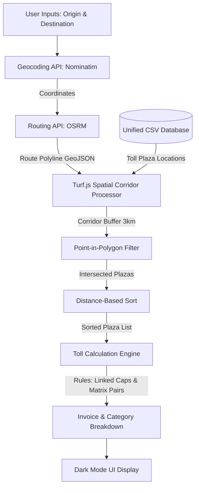

# Technical Architecture & Algorithm Analysis 🛠️

This document provides a deep-level technical analysis of the **Ridemitr Spatial Toll Engine**, details the spatial processing pipeline, and documents the algorithms used to compute toll invoices.

---

## 🧭 System Workflow & Data Flow



---

## 🛰️ 1. Spatial Processing Pipeline

To accurately map a route to the physical toll plazas it crosses, the system utilizes a modern spatial processing pipeline in JavaScript:

### Route Corridor Buffering (Turf.js)
Standard point-to-line intersections can fail due to polyline simplification, GPS drift, or coordinates being slightly off the main highway lane. Ridemitr solves this by constructing a spatial corridor buffer:
1. **Polyline Extraction**: Extracts the route coordinates `[longitude, latitude]` from the OSRM route response.
2. **Turf Line String**: Converts the coordinates into a Turf.js `LineString` feature:
   ```javascript
   const line = turf.lineString(routeGeojson.geometry.coordinates);
   ```
3. **Corridor Buffering**: Creates a **3km wide polygon corridor** around the line string using `turf.buffer`:
   ```javascript
   const bufferedRoute = turf.buffer(line, 3, { units: 'kilometers' });
   ```
   *A 3km buffer is mathematically chosen to avoid missing ramp plazas while preventing the ingestion of plazas on adjacent parallel local roads.*

### Point-in-Polygon Filtering
Each plaza in the database has a registered coordinate (`Latitude`, `Longitude`). For each toll plaza:
1. It is converted to a Turf.js `Point`.
2. A fast geometric point-in-polygon containment check is executed:
   ```javascript
   const pt = turf.point([toll.lng, toll.lat]);
   if (turf.booleanPointInPolygon(pt, bufferedRoute)) {
       intersectedPlazas.push(toll);
   }
   ```

### Chronological Distance Sorting
Since OSRM routes are directional, the toll plazas must be processed in chronological order of crossing. The intersected list is sorted by computing the spatial distance of each plaza from the route's origin point:
```javascript
const originPoint = turf.point(routeGeojson.geometry.coordinates[0]);
intersectedPlazas.sort((a, b) => {
    const distA = turf.distance(originPoint, turf.point([a.lng, a.lat]));
    const distB = turf.distance(originPoint, turf.point([b.lng, b.lat]));
    return distA - distB;
});
```

---

## 🧮 2. Toll Calculation Algorithms

Once the chronological list of intersected plazas is established, the core engine processes it through two main logic blocks: **Fixed Barriers** and **Closed-Loop Matrix Systems**.

### Block A: Fixed Barrier Algorithm

Standard barriers charge a flat rate. However, two complex rules must be applied:

#### 1. Linked System Capping (e.g., Mumbai-Pune Expressway)
Some highways have multiple barriers that operate as a unified system, applying a price cap. For example, crossing the Mumbai-Pune Expressway (plazas `3815` (Khalapur) and `3817` (Talegaon)) has a total cap of **₹320**:
*   *Algorithm*:
    1. If a plaza belongs to a linked system, track the cumulative cost charged for that system.
    2. If it is the first plaza crossed in that system, charge its full cost:
        $$\text{Cost} = \text{Toll Cost}$$
    3. If subsequent plazas in the same system are crossed, calculate the remaining balance until the cap:
        $$\text{Balance} = \max(0, \text{Cap} - \text{Cumulative Charged})$$
    4. Charge the balance instead of the flat rate.

#### 2. Expressway vs. Old Highway Route Selection
If a commuter travels on the expressway mainline, they must not be charged for the ramp plazas. Conversely, if they travel on the parallel Old National Highway (NH 48), they should not be charged for the Expressway mainline.
*   *Mainline Plazas*: `3815`, `3817`
*   *Ramp Planks*: `3814`, `3816`, `1226`, `1227`, `1228`, `1229`
*   *Algorithm*:
    *   If the `isOldHighway` route flag is active, filter out mainline plazas (`3815`, `3817`).
    *   If mainline plazas are present in the intersection list (Expressway trip), filter out all ramp plazas from the bill.

---

### Block B: Closed-Loop Matrix Algorithm

Closed-Loop systems generate a ticket at entry and calculate the fee at the exit barrier based on the distance traveled.

```
[Entry Plaza]  ───►  [Intermediate Plaza]  ───►  [Exit Plaza]
(Charge: ₹0)          (Filtered/Removed)         (Charge: Matrix Cost)
```

#### 1. Grouping and Entry/Exit Pairing
1. Filter all intersected plazas with type `"Closed Loop Matrix"`.
2. Group them by their `Highway` designation (e.g., `"NE II"`), preserving chronological order.
3. For each highway group:
   *   The first plaza is identified as the **Entry Plaza**.
   *   The last plaza is identified as the **Exit Plaza**.

#### 2. Removing Intermediate Plazas
Any plaza crossed *between* the entry index and exit index (whether it is an intermediate matrix plaza or an adjacent fixed plaza) is physically bypassed in terms of charging and removed from the active routing list:
```javascript
for (let i = entryIdx + 1; i < exitIdx; i++) {
    toRemove.add(resolvedPlazas[i].id);
}
resolvedPlazas = resolvedPlazas.filter(p => !toRemove.has(p.id));
```

#### 3. Directional Cost Fallback
Once the Entry and Exit pair is found, the engine queries the matrix database for `Entry -> Exit`. If a specific direction is missing due to database structure, it falls back to the reverse direction `Exit -> Entry`:
```javascript
let edge = matrixTolls[`${entryId}->${exitId}`];
if (!edge) {
    edge = matrixTolls[`${exitId}->${entryId}`];
}
```

---

## 📊 3. Database Schema Reference

The engine operates on a single file: `unified_tolls_schema.csv`.

| Column | Type | Description | Example |
| :--- | :--- | :--- | :--- |
| **Toll_Logic_Type** | String | Calculation classification: `Fixed Barrier` or `Closed Loop Matrix`. | `Fixed Barrier` |
| **Primary_Plaza_ID** | Integer | Unique identifier for the plaza. | `1088` |
| **Primary_Plaza_Name**| String | Human-readable name of the plaza. | `Shahpur Kalyanpur` |
| **State** | String | State where the plaza is located. | `ANDHRA PRADESH` |
| **Highway** | String | Highway code or number. | `7` |
| **Latitude** | Float | Geographic latitude of the plaza. | `30.412142` |
| **Longitude** | Float | Geographic longitude of the plaza. | `77.711422` |
| **Matrix_Entry_ID** | Integer | For closed loops: entry plaza ID. Otherwise `N/A`. | `1207` |
| **Matrix_Exit_ID** | Integer | For closed loops: exit plaza ID. Otherwise `N/A`. | `1123` |
| **Distance_Km** | Float | Distance between entry and exit (closed loop only). | `82.5` |
| **Car_Toll_INR** | Float | Car toll cost. For closed loops, this is the cost between Entry & Exit. | `65` |

---

## 🔄 4. Data Pipeline & Compilation

To build a zero-dependency client web application, the coordinates and CSV data must be synchronized:

```
[all_active_india_toll_plazas.json]
             │
             ▼ (update_unified_schema.js / update_schema.rb)
[unified_tolls_schema.csv]
             │
             ▼ (Compiles CSV into Javascript String Template)
[ridemitr-webapp/database.js] (const CSV_DATA = `...`)
```

1. **Geocoding Seed**: `all_active_india_toll_plazas.json` contains raw coordinates for all Indian plazas.
2. **Schema Compilation**: The Node.js (`update_unified_schema.js`) or Ruby (`update_schema.rb`) script matches the plaza IDs, copies `Latitude` and `Longitude` values, and writes them back into the CSV.
3. **JS Database Injection**: Reads the compiled CSV and injects it as a template string into `ridemitr-webapp/database.js` as `const CSV_DATA = \`...\`` so that PapaParse can read the dataset directly in-memory in the browser without CORS fetch errors.
